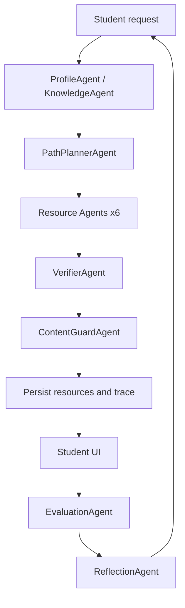

# 智能体设计

## 1. 设计目标

EduPath Agent 使用多智能体协作完成“画像、检索、规划、生成、验证、评估、反思”的学习闭环。设计原则是职责单一、输入输出结构化、过程可追踪、内容可验证。

## 2. 智能体清单

| Agent | 职责 | 主要输入 | 主要输出 |
|---|---|---|---|
| ProfileAgent | 从对话中抽取 8 维学习画像 | 学生自然语言、课程上下文 | base_level、weak_points、preference 等画像字段 |
| KnowledgeAgent | 检索课程知识点上下文 | knowledge_point_id、course_id | 知识点摘要、关键内容、来源、案例素材 |
| PathPlannerAgent | 生成个性化学习路径 | 学生画像、课程知识点 | 有序 path nodes 和推荐理由 |
| LectureAgent | 生成个性化讲义 | 知识点上下文、画像 | Markdown 讲义 |
| MindMapAgent | 生成思维导图 | 知识点上下文 | Mermaid mindmap |
| ExerciseAgent | 生成分层练习 | 知识点上下文、难度 | JSON 练习集合 |
| CaseAgent | 生成实操案例 | case_materials、知识点 | 实操任务、步骤、参考代码 |
| ExtendedReadingAgent | 推荐拓展阅读 | tags、sources | 阅读清单与摘要 |
| VideoStoryboardAgent | 生成视频分镜 | 知识点上下文 | 场景脚本和 PPT 提纲 |
| EvaluationAgent | 评估学生答案 | exercise、user_answer | score、is_correct、feedback、mistake_tags |
| ReflectionAgent | 根据评估更新画像 | evaluation_result、current_profile | profile_changes、change_reason、remediation |
| VerifierAgent | 检查生成内容事实一致性 | resource、source_context | confidence、warnings |
| ContentGuardAgent | 内容安全与边界检查 | resource content | safety_status、blocked_reason |
| TutorAgent | 追问辅导（P1） | question、context | 带来源引用的 JSON 回答 |

## 3. 编排流程

资源生成任务通过 `AgentTask` 记录整体状态，通过 `AgentTrace` 记录每个智能体的输入摘要、输出摘要、耗时、状态、warning 和置信度。前端资源页展示这些轨迹，避免“黑盒生成”。

## 4. Prompt 原则

- 所有生成类 Agent 必须绑定课程知识库上下文。
- 输出优先结构化 JSON，便于 API 和前端解析。
- 对不确定内容写入 warning，不把猜测包装成确定事实。
- 学习画像更新必须包含 evidence 和 change_reason。
- 安全过滤失败时不展示原始不安全内容，只展示阻断原因。

## 5. LLM Provider

系统通过 `LLMClient` 抽象调用模型：

- `mock`：测试和离线演示默认 provider。
- `deepseek`：开发期临时 provider。
- `spark`：最终提交与赛题合规 provider，通过 `sparkai` SDK 接入科大讯飞星火。

测试环境强制使用 mock，避免 CI 或课堂演示依赖外部 API。

